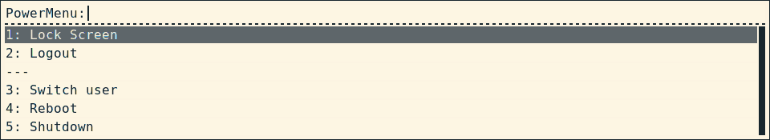

================
Simple Rofi menu
================
What started as a < 20 lines script to make a simple power menu to use with Rofi_.

Screenshot
==========

Usage
=====
To use the menu with rofi, use::

    rofi -show <name> -modi <name>:<path>/simple_rofi_menu.py.

The script will then fetch your `srm_config.<extension>` file, in the same folder as `simple_rofi_menu.py`. You can find examples in the `example_configs/` folder.

As of now, SRM supports YAML and JSON formats. SRM will look for the YAML one first, then the JSON one. If you intend on using a YAML configuration file, you will need to have PyYAML_ installed.

Note: since this script uses `/usr/bin/python3`, you can do so using `pip3 install PyYAML --user` to use your general Python environment, or just change the shebang line to whatever virtualenv you want to use, as long as it's based on Python 3.

Documentation
=============
Menu
----
    **\*groups**
        | Type: MenuGroup_
        | As many as you want, as positional arguments.

    [keyword argument] **numbered**
        | Type: Boolean
        | Default: `False`
        | Auto-numbering of all menu items.

    [keyword argument] **index_start**
        | Type: Integer
        | Default: `0`
        | Index of the first menu item if `numbered` is `True`.

    [keyword argument] **index_format**
        | Type: String
        | Default: `"{item_index} {item_name}"`
        | Format for updating each `MenuItem` if `numbered` is `True`, which must define `{item_index}` and `{item_name}`.

    [keyword argument] **separator**
        | Type: String
        | Default: `"---"`
        | Separates menu groups.

MenuGroup
---------
    **\*items**
        | Type: MenuItem_
        | As many as you want, as positional arguments.

MenuItem
--------
    **name**
        | Type: String
        | Name to be displayed in the menu.

    **command**
        | Type: String
        | Command to be executed upon selecting this item

.. _Rofi: https://davedavenport.github.io/rofi/
.. _PyYAML: https://pypi.python.org/pypi/PyYAML